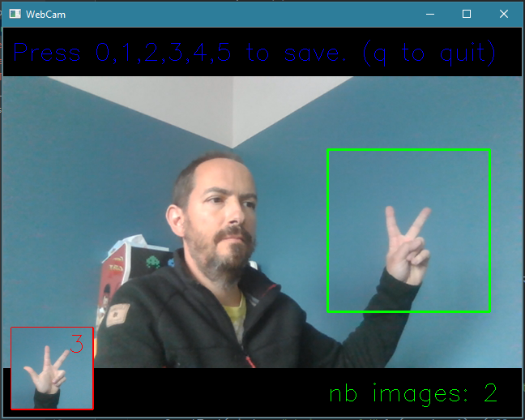

# Neural Networks Counting Fingers Project

## Environment:

Python 3.6

Pandas / OpenCV / sickit-learn / Keras(TensorFlow) see requirements.txt

## Introduction:

Final target is to be able to count how many fingers are shown to the webcam. 

I will investigate different techniques used in classification and check how they perform on this problem in terms of training speed and accuracy to predict classification for unseen image.

I first started by using a dataset found on Kaggle [here](https://www.kaggle.com/koryakinp/fingers), but images were already preprocessed and dataset was too clean... leading to very good results on dataset but not very good for generalization.

I then decided to create my own dataset...

## Dataset creation

I wrote the **capture_fingers.py** (available [here](create_dataset/capture_fingers.py)), to record easily images for each class (0,1,2,3,4,5).

Images are captured from webcam stream in png format (size: 200x200px)

Images name are 2_original_123.png where the first digit is the class (number of finger shown on the picture) and the last number is a unique id to not overwrite pictures.

The idea was to work with few images, but still needing some variety. I captured 577 pictures for all numbers using 4 different people... (my sons, my wife and I :-) )

## Data Augmentation

As the number of pictures is small, I decided to do some data augmentation.

Script can be found [here](create_dataset/augment_dataset.py). It applies randomly one or more transformations to images among originals.

Available transformations are: rotate, shift x and y, zoom in, add noise, shear, change brightness.

It outputs n images per class (where n is a parameter) in the data/augmented folder.

## ML classifiers: SGD / KNN / SVC / RandomForest...

## Multi Layer Perceptron (using sickit-learn)

## MLP (using Keras-TensorFlow)

## Convolutional Neural Networks

## Using pre-trained Networks (VGG16)