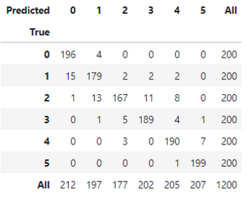

# Neural Networks Counting Fingers Project

Available on https://github.com/terman37/Neural_Networks_Counting_Fingers

## Environment:

Python 3.6

Pandas / Numpy / OpenCV / Sickit-Learn / Keras (TensorFlow) 

See requirements.txt

## Introduction:

Final target is to be able to count how many fingers are shown to the webcam. 

I will investigate different techniques used in classification and check how they perform on this problem in terms of training speed and accuracy to predict classification for unseen image.

I first started by using a dataset found on Kaggle [here](https://www.kaggle.com/koryakinp/fingers), but images were already preprocessed and dataset was too clean... leading to very good results on dataset but not very good for generalization.

I then decided to create my own dataset...

## Dataset creation

I wrote the **capture_fingers.py** (available [here](create_dataset/capture_fingers.py)), to record easily images for each class (0,1,2,3,4,5).

Images are captured from webcam stream in png format (size: 200x200px)

Images name are 2_original_123.png where the first digit is the class (number of finger shown on the picture) and the last number is a unique id to not overwrite pictures.

The idea was to work with few images, but still needing some variety. I captured 600 pictures for all numbers  (100 for each)

## Data Augmentation

As the number of pictures is small, I decided to do some data augmentation.

Script can be found [here](create_dataset/augment_dataset.py). It applies randomly one or more transformations to images among originals.

Available transformations are: rotate, shift x and y, zoom in, shear.

It outputs n images per class (where n is a parameter), creates a standard folder structure, and convert images to grayscale 100x100px to speed up calculation.

In our case, I generated from the original images :

- I kept 20% of each class as test set - 120 images augmented to 1200.
- It used 15% of remaining images as validation set - 90 images augmented to 900.
- 6000 augmented images (1000 per class) from the remaining 

## ML classifiers: SGD / KNN / SVC / Random Forest...

One approach would be to consider the problem as a standard classification problem. Input image (100*100) is flattened into a vector (10000), then we can apply classical ML techniques.

In order to reduce dimensionality of the problem and reduce training time, I applied a PCA preserving 99% of the variance. After PCA dimension is reduced to 800. 

Using for example K Nearest Neighbors algorithm, after some finetuning we are able to achieve **84%** of accuracy on test set. We will see later on how it works on new real data directly from the webcam.

Confusion matrix show relatively spread errors:

  

[notebook](training/ml_classifier_training.ipynb)

## Fully connected Neural Network

For the fun, I have tried to classify using a neural network using only fully connected layers. It's not a very good tool to deal with images and after some experiments I can confirm... that i have not been able to achieve something correct.

Even with quite big number of neurons, I have not been able to increase accuracy... above 16% (which is equivalent to pure random 1/6)

[notebook](training/fc_training.ipynb)

## Convolutional Neural Networks

Here we should have a better tool to work on images... I have used classical sequential architecture:

Using a batch size of 64, after only 15 epochs the model achieves **88%** of accuracy on test set. I used early stopping based on the minimal validation loss to avoid overfitting.

Evolution of loss and accuracy looks good and show a converging model:

Confusion matrix:

Most of the errors come from 5 that will be predicted as 4.

[notebook](training/cnn_training.ipynb)

## CNN pre-processing the image

Exactly same CNN model, but this time using a bit of preprocessing with OpenCV on the image to show only the shape.

We can see now even better behavior of our CNN. We are able to achieve **93%** accuracy on test set.

Confusion matrix:

Different errors: here it seems that most frequent one is for 1 predicted as 0.

[notebook](training/cnn_training-with-preprocess.ipynb)

## VGG16

Now let's try with a deeper Neural Network, the VGG16 architecture. I removed the top dense layers, to apply a custom one consisting of a dense layer with 1000 neurons and a last one to classify with 6 outputs.

I didn't use pretrained weights on Imagenet, I was not sure if images in grayscale could have a lot in common in terms of training with Imagenet colored ones.

Results are still better, I managed to achieve around **98%** of accuracy on test set. Of course, model is larger (almost 20 millions parameters (230Mo) vs 3.5 millions (40Mo) in classical CNN architecture.)

Confusion matrix is almost perfect:

[notebook](training/vgg16_training.ipynb)

## Live predictions

Let's now try on live images from webcam. Code is available [here](predicting/predict_fingers.py).

Predictions from the different models are displayed on the screen.

Without surprise, model made with KNN is the less accurate, making a lot of mistake with most of the numbers.

All neural networks are performing better. I would say after playing with it a little bit that CNN with preprocessing and VGG16 are quite close in terms of performance. It remains the point that VGG16 is much heavier model (230Mo vs 40Mo for CNN). One would have to choose if model size matter against slightly better accuracy.

Preprocessing technique gives of course better results if background is different. Background still has to be homogenous but predictions made on white background for example will be better with preprocessing than with VGG16. 

Project could still be improved with more preprocessing for example with removing background techniques to make it work in any situation.

Anyway, results are really great and shows power of convolutional neural networks with quite easy implementation.

